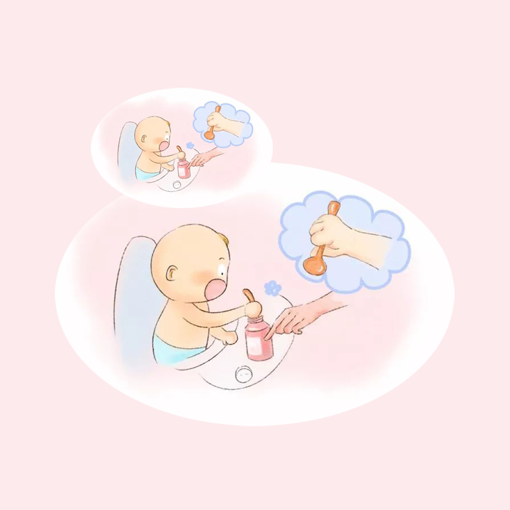

## Welcome to My Baby Use Spoon Feed Record

Learning to eat with a spoon is a life skill that your baby must have while growing up. As the closest parents to our babies, we should work hard to help and educate our babies to learn to eat with spoons at the right age. We can record the baby's eating habits with a spoon, the experience of using the spoon, and the color of the spoon. In this way, we can better understand our baby's preferences, and we can help our baby learn the skill of using spoons faster and more efficiently.

If you have any questions, you can either leave a message or send the questions to our email address.

We will answer them for you in the first time.

### Address: jichungan9498@163.com

Thank you!
